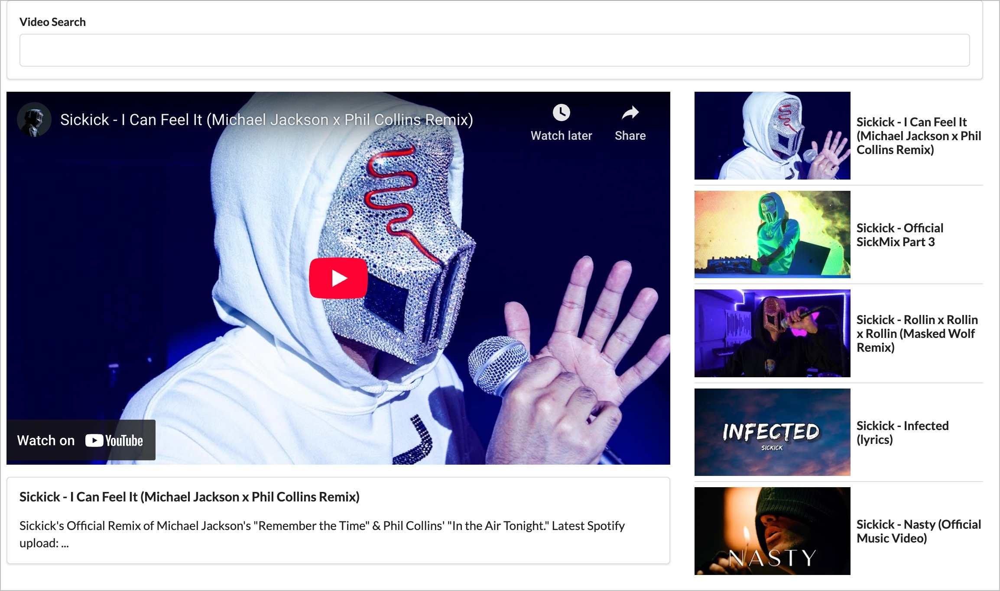

# YouTube Video Search App

This project is a simple React application that allows users to search for YouTube videos and view details about selected videos. It demonstrates how to integrate with the YouTube Data API using Axios and showcases core React concepts such as component composition, state management, and handling asynchronous API requests.

---

## Features

- 🔍 Search for YouTube videos by keyword
- 📺 View a list of video results with thumbnails and titles
- ▶️ Select a video to view details and play it via embedded YouTube player

---

## Screenshot

<!-- TODO: Insert screenshot here -->


---

## Learning Concepts

- React class components and state management
- Passing data and callbacks between parent and child components via props
- Handling user input and form submission
- Making HTTP requests with Axios
- Conditional rendering
- Basic CSS styling and use of Semantic UI for layout

---

## Getting Started

Install dependencies:
``` npm install ```

Start the development server:
``` npm start ```

Open http://localhost:3000 in your browser.

## Notes

You will need a valid YouTube Data API key in youtube.js.

This project was bootstrapped with Create React App before it was depricated.